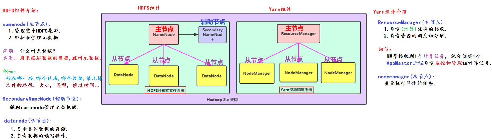

### 一、数据介绍

```shell
概述:
	对人们的行为做的一种记录，简单来说：一切皆数据。
目的:
	对数据开展分析，可以帮助人们更好的了解事与物存在的规律；
	对海量数据做分析，从海量数据中提取出有效的价值信息，实现数据的商业化和价值化；
	给企业决策者或者运营人员提供数据支持或者分析性报告。
```

### 二、大数据的发展

```shell
1970年之前：计算机还都是互相独立的，即："单机版"；
1970年之后：计算机开始实现小规模的互联；
1990年及其以后：开始逐步实现全球互联，数据量飞速增长，有了大数据的概念；
2008年：Apache Hadoop（现称：社区版Hadoop）开源，给众多企业提供了分布式存储和计算等技术。
```

### 三、大数据的介绍

```shell
什么是大数据
  狭义上：指的是处理海量数据的技术，即：软件技术体系。
  广义上：指的是数据化，信息化时代的（基础）建设，以数据为生活赋能，为社会主义建设添砖加瓦。
大数据的特点
	大：数据的体量比较大，数据单位从小到大分别是：bit、byte、kb、mb、gb、tb、pb、eb、zb、yb、bb、nb、db；
	多：数据的种类比较繁多
		结构化数据：MySQL的表数据
		半结构化：  json字符串、html
		非结构化：  图片、音频、视频等；
	值：数据的价值密度比较低；
	快：数据的传输速度、增长速度、处理速度比较快；
	信：数据的可信赖度比较高。
```

### 四、Apache Hadoop介绍

```shell
简介
  它是Hadoop的开源版本，由HDFS（存）、MapReduce（计算）、Yarn（资源调度）三大组件组成。
Hadoop由来
  道格·卡丁（Doug Cutting）早期做了一个爬虫框架叫Nutch（Java写的），非常好用，但是遇到了一个问题即：如何来存储和计算爬取到的海量网页数据。这个时候谷歌的三篇文章给了他灵感，也被称之为“大数据的三驾马车”。
  2003，谷歌发表GFS：HDFS（Hadoop Distributed File System）
  2004，谷歌发表MapReduce：MapReduce
  2006，谷歌发表BigTable：HBase
Hadoop版本
  社区版：指的是Apache Hadoop，免费、稳定性稍差，但是更新速度快。
  商业版：指的是CDH、星环等，收费、稳定性较好，但是更新周期相对较慢。
```

### 五、集群和分布式介绍

```shell
集群和分布式
  集群：多个人做相同的事儿。
  分布式：多个人做不同的事儿，然后构成一个整体。
主从模式（中心化方式）
  一个大哥带着一群小弟一起干活。Hadoop用的就是这种方式，如：
HDFS：大数据分布式存储架构。
  namenode：大哥，主节点
  SecondaryNameNode：秘书，辅助节点
  datanode角色：小弟，从节点
MapReduce：代码级别的，没有角色划分，直接通过Python或者Java操作即可。
Yarn：统一的资源和任务调度器
	ResourceManager：主节点
	nodemanager：从节点
主备模式
  一群大哥一个干活（Active激活），其它的监控（StandBy备用），宕机就上。
```
### 六、Apache Hadoop框架
```shell
简介
  狭义上：指是Hadoop软件本身，有HDFS、MapReduce、Yarn组件组成。
  广义上理解：指是Hadoop生态圈，包含Hadoop周边所有的技术，例如：Oozie、Sqoop、Flume、...
Apache Hadoop架构
  Hadoop2.X以前：
	HDFS组件：责存储
	MapReduce组件：负责计算
  Hadoop2.X及其以后:
    HDFS组件：负责存储
    MapReduce（代码级别）：负责计算
    Yarn组件：负责任务接收和资源调度
```
**HDFS组件和Yarn组件结构图**

**MapReduce介绍**
```shell
  它是代码级别的Hadoop架构的一部分，负责计算，采用分而治之的思想。即：把大问题拆分成N个小问题，小问题解决了，大问题也就解决了。
    如：计算 1 ~ 1000 之间的质数和
    可以拆分成3份，一个算 1~300；另一个算 301~700；最后一个算 701 ~ 1000，然后将结果汇总。
是不是所有的场景都可以用分而治之思想解决?
  不一定。如果大任务拆分成N个小任务之后小任务之间的依赖度比较高，就不推荐使用。
  如：求 1 ~ 7 之间所有数字的平均值
    正确做法：
      1 + 2 + 3 + 4 + 5 + 6 + 7 = 28 / 7 = 4
    分而治之思想:
	  第1个人：算 1 ~ 3 的平均数，1 + 2 + 3 = 6 / 3 = 2；
	  第2个人：算 4 ~ 5 的平均数，4 + 5 = 9 / 2 = 4.5；
	  第3个人：算 6 ~ 7 的平均数，6 +7 = 13 / 2 = 6.5，最终结果为：(2 + 4.5 + 6.5) / 3 = 13 / 3 = 4.33333...
其他
  MapReduce程序所需的数据源及结果数据的存储都是由HDFS来完成的。
  MapReduce程序执行所需的资源等都是由Yarn来调度的。
```
### 七、Apache Hadoop环境搭建
```shell
参考：./documents/01-hadoop集群搭建.doc
```
### 八、Hadoop集群初体验
```shell
1.计算圆周率
  cd /export/server/hadoop/share/hadoop/mapreduce
  hadoop jar hadoop-mapreduce-examples-3.3.0.jar pi 5 10
2.词频统计（WordCount案例）
  cd /export/server/hadoop/share/hadoop/mapreduce
  hadoop jar hadoop-mapreduce-examples-3.3.0.jar wordcount /wordcount/input/word.txt /wordcount/output
```