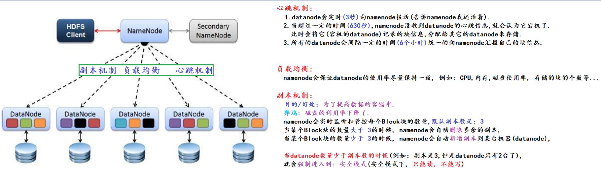
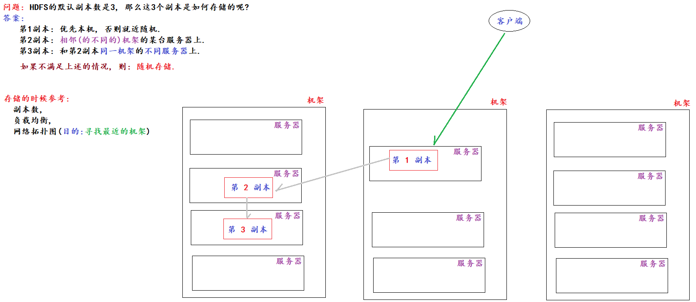
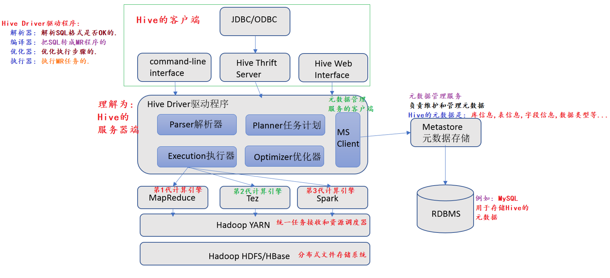
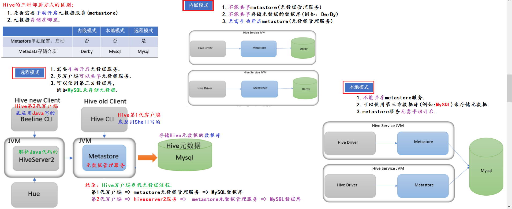

### 一、HDFS简介

```shell
hdfs简介
  全称Hadoop Distributed File System，是Hadoop框架的一个组件，用于实现分布式存储。
  即：HDFS是大数据分布式存储文件系统，可以存储海量数据。
HDFS存储思路
  由Client（客户端）对文件进行切块（默认128MB/块，可修改），然后由namenode分配到不同的datanode上存储。
HDFS组件的角色划分
  HDFS Client
    负责文件切分
    负责和namenode、datanode交互
    负责副本策略，集群的启动和关闭
  namenode
    1.管理整个HDFS集群
    2.维护和管理元数据
  SecondaryNameNode
    辅助namenode管理元数据
  datanode
    负责具体数据（块）的存储
    负责数据的读写操作
    定时向namenode汇报自己的块信息
HDFS的适用场景
  1.存储海量的大文件
  2.对数据的时效性要求相对较低
  3.一次写入，多次读取
  4.随机读写要求相对较低
```

### 二、namenode如何管理datanode



### 三、HDFS默认的3副本数是如何存储



### 四、HDFS Shell命令

```shell
格式：如下两种方式，除了通用性以外，其它没区别
  hadoop fs -命令名 [选项] [参数]    # 更通用, 可以操作多种文件系统
  hdfs dfs -命令名 [选项] [参数]     # 只能操作HDFS文件系统

ls
  hadoop fs -ls /   # 只能查看单级
  hdfs dsf -ls /    # 只能查看单级
  hadoop fs -lsr /	# 查看目录的信息（包括所有子集），已过时
  hadoop fs -ls -R /  # 查看目录的信息（包括所有子集），推荐使用
mkdir
  hadoop fs -mkdir /aa
  hadoop fs -mkdir -p /aa/bb/cc
put
  格式：hadoop fs -put Linux文件路径 HDFS目录路径
  hadoop fs -put /root/1.txt /aa/bb/cc
cat
  hadoop fs -cat /aa/bb/cc/1.txt
get
  格式: hadoop fs -get HDFS文件路径 Linux目录路径
  hadoop fs -get /aa/bb/cc/1.txt ./
mv
  必须是HDFS -> HDFS
  hadoop fs -mv /aa/bb/cc/1.txt /aa/bb
cp
  必须是HDFS -> HDFS
  hadoop fs -cp /aa/bb/cc/1.txt /aa/bb
rm
  文件夹：用-rmr，已过时，推荐使用-rm -r
  hadoop fs -rmr /aa
appendToFile  
  唯一一个可以修改HDFS文件内容的命令，即：把1个文件数据追加到某个文件中
  Linux -> HDFS
  hadoop fs -appendToFile Linux文件路径 HDFS文件路径
  hadoop fs -appendToFile /root/2.txt  /aa/1.txt
```

### 五、分布式SQL计算

```shell
概述
  就是通过分布式（多机器）的方式执行SQL计算，获取结果。
为啥不学习用java和python操作MR程序
  Java、Python学习成本相对较高
  直接用编程语言操作MR开发复杂业务时难度相对较大
Apache Hive数据分析
  即：通过写Hive SQL的方式开展分析，底层会将其转成MR程序来执行。
MR程序的两个弊端是什么
  1.开发难度相对较大	 # 通过Hive解决，写SQL -> 底层自动转MR程序
  2.执行速度相对较慢	 # 换计算引擎，如：Presto、Spark、Flink...
基于MapReduce构建分布式SQL引擎需要有哪些组件
  元数据管理服务（metastore）：负责管理元数据
  SQL解析器：负责解析SQL，将其转成MR程序运行并获取结果然后返回
```

### 六、Hive架构图



### 七、Hive三种部署方式



### 八、Hive安装

```shell
参考：./documents/02-hive安装.doc
```

### 九、Hive第1代客户端

```shell
0.启动Hadoop
  start-all.sh
1.启动metastore元数据管理
  前台启动
    hive --service metastore
  后台启动
    nohup hive --service metastore &
2.启动hive的客户端，然后就可以写SQL了
  hive    # 直接敲回车即可
```

### 十、Hive第2代客户端

```shell
0.启动Hadoop集群和metastore
  start-all.sh
  nohup hive --service metastore &
1.启动hiveserver2
  nohup hive --service hiveserver2 &
2.启动hive的第2代客户端
tips
  启动hiveserver2服务后等待2分钟左右再用第2代客户端连Hive，因为hiveserver2初始化要时间。
  beeline
  !connect jdbc:hive2://xs:10000
  root	  # 输入账号
  无需输入密码，敲回车
```

### 十一、数据仓库概述

```shell
简介
  全称叫Data WareHouse，简称DW，DWH，就是用来存储数据的，以便于做分析用。
  数仓的数据可以是业务数据、日志数据、第三方数据、爬虫数据等。
  数据仓库的目的是把各种数据源整合到一起方便做数据分析用，即：从海量的数据中提取出有价值的信息，实现数据的商业化、价值化，给企业决策者或者运营人员提供数据支持或者分析型报告。
数据仓库（OLAP）和数据库（OLTP）的区别
数据仓库:  
  OLAP（Online Analytical Processing）：联机分析处理
  面向主题，主要是做数据分析用的，一般处理的是历史（离线）数据
  数据量相对较大，对数据的时效性要求相对较低且大多数操作主要是查询
数据库:	
  LTP（Online Transaction Processing）：联机事务处理
	面向业务，主要是做数据采集用。按照业务采集数据，一般处理的是在线（实时）数据
	数据量相对较小，对数据的时效性要求较高，且大多数操作都是增删改查
数仓的特点
  1.面向主题    # 数仓都是面向主题开展分析的，不然无意义
  2.集成性	   # 数仓可以集多种数据源（业务数据、日志数据、第三方数据、爬虫数据等）于一体
  3.非易失性	   # 数仓分析的主要是离线数据，离线数据 <=> 不可修改的数据
  4.时变性	   # 随着业务的增加和调整，数据源发生变化，数仓也要相应的做出调整
经典的数仓分层
  ODS：源数据层、贴源层
  DW：数仓层
  DA：数据应用层
ETL和ELT的区别
  ETL：旧式数仓架构，即：先抽取（Extact）-> 再转换（Transform）-> 再存储（Load） 
    弊端：可能会把后续要用的数据给清理掉
  ELT：新式数仓架构，即：先抽取（Extract）-> 直接存储数仓中（Load），最后再用什么就转换什么
```
